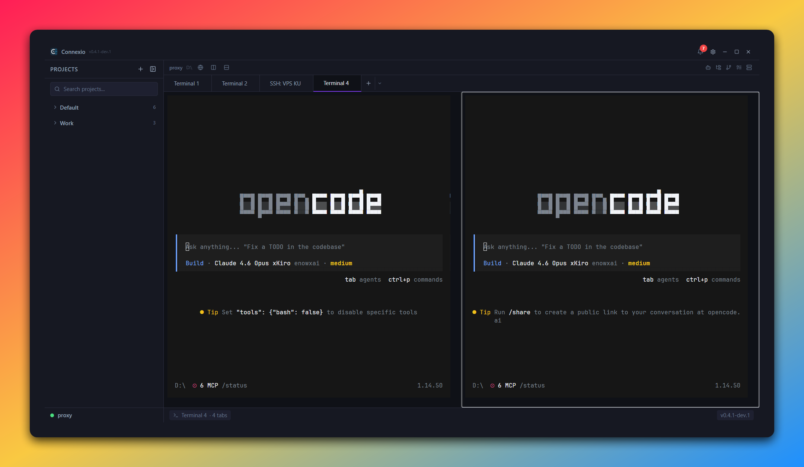

# Connexio

> **Project-based Terminal Manager** — Organize your terminals by project, not by window.

[](https://github.com/yandanp/Connexio/releases/latest)
[](https://github.com/yandanp/Connexio/releases/latest)
[](LICENSE)
[](https://github.com/yandanp/Connexio/releases)

> ⚠️ **v0.4.x is in active development** — Fully migrated from Electron to Tauri v2 with a native Rust backend. Pre-release builds are available but not yet recommended for general use.

## 📸 Preview

<p align="center">
  
</p>

## 🎯 Problem

When working on multiple projects, you end up with dozens of terminal windows/tabs with no clear organization. Which terminal belongs to which project? Where was that running server?

## ✨ Solution

Connexio organizes your terminals **by project**. Each project gets its own workspace with dedicated terminal tabs, persistent sessions, and productivity tools built right in.

## 🚀 Features

### Core

- **📁 Project Workspace** — Each project has its own workspace with dedicated terminals
- **📑 Multi-tab Terminals** — Multiple terminal tabs per project with rename & drag-to-reorder
- **🐚 Shell Picker** — Auto-detect available shells (PowerShell, CMD, Git Bash, WSL, Zsh, Fish, etc.)
- **💾 Session Persistence** — Tabs, layout, and active project survive app restart
- **🔀 Drag & Drop** — Reorder tabs, reorder projects, move projects between groups
- **⚡ WebGL Renderer** — Hardware-accelerated terminal rendering (toggleable in settings)

### Productivity

- **📋 Task Runner** — Auto-detect scripts from `package.json`, `Makefile`, `Cargo.toml`, `pyproject.toml` — one-click run
- **📌 Pinned Commands** — Save favorite commands per project (CRUD, drag reorder)
- **⏱️ Command Timer** — Track execution time, notification when long-running commands finish
- **📝 Code Editor** — Built-in editor powered by CodeMirror 6 (JS, TS, HTML, CSS, Python, Rust, JSON, Markdown)
- **📂 File Explorer** — Full file tree with context menu and inline actions
- **🌐 Web Preview** — Live preview panel as a workspace tab

### Git Integration

- **🌿 Git Status** — Live branch, ahead/behind, modified/staged/untracked counts
- **🔀 Branch Picker** — Switch branches from the workspace header
- **💬 Commit Box** — Stage and commit directly from the UI
- **📜 Git History** — View commit history per project

### Connectivity

- **🔗 SSH Manager** — Save SSH connections per project + global, one-click connect with key or password auth
- **🤖 AI Chat** — Side panel with configurable model integration
- **🎮 Discord Rich Presence** — Show what you're working on in Discord
- **🔄 Auto-Updater** — Check for updates via GitHub Releases, download & install with one click

### Customization

- **🎨 Themes** — Built-in themes (Dark, Light, Midnight Ocean) with full terminal color support
- **⚙️ Settings** — Font size, font family, cursor style, scrollback, copy-on-select, default shell, WebGL toggle
- **🖥️ Custom Titlebar** — Clean frameless window with app version display
- **📐 Resizable Panels** — Split panes for editor + terminal side-by-side layout

## 📥 Download

| Platform | Download |
| -------- | -------- |
| Windows | [Connexio_x64-setup.exe](https://github.com/yandanp/Connexio/releases/latest) |
| macOS (Apple Silicon) | [Connexio_aarch64.dmg](https://github.com/yandanp/Connexio/releases/latest) |
| macOS (Intel) | [Connexio_x64.dmg](https://github.com/yandanp/Connexio/releases/latest) |
| Linux | [Connexio_amd64.AppImage](https://github.com/yandanp/Connexio/releases/latest) |

Or go to [Releases](https://github.com/yandanp/Connexio/releases) for all versions including pre-releases.

## 📦 Tech Stack

| Technology | Purpose |
| --- | --- |
| **Tauri v2** | Cross-platform desktop framework |
| **Rust** | Native backend (PTY, git, SSH, file system) |
| **portable-pty** | Native PTY process management |
| **React 18** | UI framework |
| **TypeScript** | Type safety |
| **xterm.js** | Terminal rendering (with WebGL addon) |
| **CodeMirror 6** | Code editor |
| **Zustand** | State management |
| **Tailwind CSS** | Styling |
| **Vite** | Frontend build tool |
| **tauri-plugin-store** | Persistent storage |
| **tauri-plugin-updater** | Auto-update via GitHub Releases |
| **discord-rich-presence** | Discord RPC integration |

## 🛠️ Development

### Prerequisites

- **Node.js** 18+
- **Rust** (latest stable via [rustup](https://rustup.rs/))
- **Platform-specific dependencies:**
  - **Windows:** [WebView2](https://developer.microsoft.com/en-us/microsoft-edge/webview2/) (usually pre-installed on Windows 10/11), Visual Studio C++ Build Tools
  - **macOS:** `xcode-select --install`
  - **Linux:** `sudo apt install libwebkit2gtk-4.1-dev build-essential curl wget file libxdo-dev libssl-dev libayatana-appindicator3-dev librsvg2-dev`

### Setup

```bash
git clone https://github.com/yandanp/Connexio.git
cd Connexio
npm install
npm run dev
```

### Scripts

| Command | Description |
| --- | --- |
| `npm run dev` | Start Tauri dev mode (hot-reload frontend + Rust backend) |
| `npm run dev:renderer` | Start Vite dev server only (frontend) |
| `npm run build` | Build frontend for production |
| `npm run build:tauri` | Build full Tauri app (installer) |
| `npm run typecheck` | Type-check all TypeScript |

### Release

```bash
npm version prerelease --preid=dev   # bump dev version
git push && git push --tags          # triggers GitHub Actions → multi-platform build & release
```

Tag patterns for release channels:
- `v1.0.0` — Stable release
- `v1.0.0-dev.1` — Dev pre-release
- `v1.0.0-alpha.1` / `v1.0.0-beta.1` — Alpha/Beta pre-release

## 📁 Project Structure

```
Connexio/
├── src/
│   ├── renderer/                # React frontend
│   │   ├── components/
│   │   │   ├── Workspace.tsx         # Main workspace (tabs, terminal, panels)
│   │   │   ├── Terminal.tsx          # xterm.js terminal instance
│   │   │   ├── TerminalLayer.tsx     # Global terminal renderer (never unmounts)
│   │   │   ├── Sidebar.tsx           # Project sidebar with drag & drop
│   │   │   ├── TaskPanel.tsx         # Task runner + pinned commands
│   │   │   ├── SSHPanel.tsx          # SSH connection manager UI
│   │   │   ├── GitStatusBar.tsx      # Git status display
│   │   │   ├── SearchPanel.tsx       # Terminal search
│   │   │   ├── SettingsModal.tsx     # Settings UI
│   │   │   ├── ShellPicker.tsx       # Shell selection dropdown
│   │   │   ├── WorkspaceTab.tsx      # Draggable, renameable tab
│   │   │   ├── WebPreview.tsx        # Live web preview panel
│   │   │   ├── WelcomeScreen.tsx     # Welcome/onboarding screen
│   │   │   ├── UpdateNotification.tsx
│   │   │   ├── ai/                   # AI chat panel
│   │   │   ├── editor/              # CodeMirror code editor
│   │   │   ├── explorer/            # File explorer tree
│   │   │   └── git/                 # Branch picker, commit box, history
│   │   ├── stores/              # Zustand state management
│   │   ├── hooks/               # Custom React hooks
│   │   ├── lib/                 # Utility functions
│   │   ├── styles/              # Global CSS
│   │   └── types/               # TypeScript declarations
│   └── shared/
│       └── types.ts             # Shared types (frontend ↔ backend)
├── src-tauri/
│   ├── src/
│   │   ├── main.rs              # Tauri app entry point
│   │   ├── lib.rs               # Plugin registration & command setup
│   │   └── modules/
│   │       ├── pty/             # PTY process management (portable-pty)
│   │       ├── projects.rs      # Project CRUD
│   │       ├── workspace.rs     # Workspace state persistence
│   │       ├── session.rs       # Session persistence
│   │       ├── settings.rs      # App settings + shell detection
│   │       ├── shell.rs         # Shell detection & configuration
│   │       ├── git.rs           # Git status & operations
│   │       ├── tasks.rs         # Task runner (script detection)
│   │       ├── pinned.rs        # Pinned commands
│   │       ├── ssh.rs           # SSH connection manager
│   │       ├── theme.rs         # Theme management
│   │       ├── explorer.rs      # File system explorer
│   │       ├── clipboard.rs     # Native clipboard handling
│   │       ├── notification.rs  # Desktop notifications
│   │       ├── discord.rs       # Discord Rich Presence
│   │       └── updater.rs       # Auto-updater
│   ├── tauri.conf.json          # Tauri configuration
│   ├── Cargo.toml               # Rust dependencies
│   └── capabilities/            # Tauri permission capabilities
├── assets/                      # App icons
├── .github/workflows/           # CI/CD (multi-platform release)
├── vite.config.ts               # Vite configuration
├── tailwind.config.js           # Tailwind configuration
└── package.json
```

## 🎨 Themes

| Theme | Style |
| --- | --- |
| **Connexio Dark** | Default dark theme with purple accents |
| **Connexio Light** | Clean light theme |
| **Midnight Ocean** | Deep blue with teal accents |

Themes apply to both the app UI and terminal colors.

## 🤝 Contributing

Contributions are welcome! Please feel free to submit a Pull Request.

1. Fork the repo
2. Create your feature branch (`git checkout -b feat/amazing-feature`)
3. Commit your changes (`git commit -m 'feat: add amazing feature'`)
4. Push to the branch (`git push origin feat/amazing-feature`)
5. Open a Pull Request

### Commit Convention

| Prefix | Usage |
| --- | --- |
| `feat:` | New feature |
| `fix:` | Bug fix |
| `refactor:` | Code refactoring |
| `ci:` | CI/CD changes |
| `chore:` | Maintenance |

## 📄 License

MIT © [yandanp](https://github.com/yandanp)
